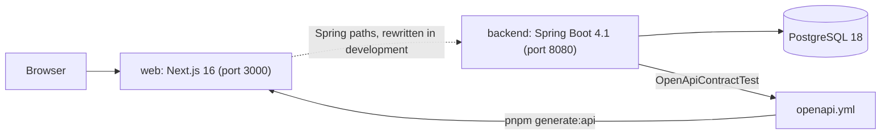

# BeyondPilot architecture

This page states what is implemented today. Intended outcomes are in [docs/vision.md](docs/vision.md); planned work is in [docs/roadmap.md](docs/roadmap.md) and never appears here as a fact. Update this page in the change that makes a statement true or false.

## Runtime overview

- **backend** is one Spring Boot application on Java 25 with virtual threads ([ADR 0001](docs/decisions/0001-single-spring-boot-application-with-modulith-modules.md)). Over HTTP it answers `/actuator/health`, the sign-in endpoints and `GET /api/identity/me`, and every failure as an RFC 9457 problem.
- **web** is one Next.js App Router application ([ADR 0002](docs/decisions/0002-nextjs-frontend-over-the-spring-backend.md)). It serves the public home page in English at `/` and in Vietnamese at `/vi`, the sign-in pages, the published programs, the public directories of AI solutions and AI talent, a signed-in person's own pages under `/workspace`, the operators' area under `/admin`, and a shared coming-soon page for the planned destinations listed in `web/src/lib/site.ts`. Pages read the backend on the server with the caller's session; a change is sent from the browser, and the page is then read again.
- **One origin.** Spring owns `/api`, `/login`, `/logout`, `/oauth2` and `/ott`. During development Next.js rewrites those paths to `BEYONDPILOT_API_ORIGIN`; `web/src/proxy.ts` excludes them from locale routing. When the stack runs in containers, a reverse proxy in front of both routes them: Nginx Proxy Manager on a deployed host, an nginx stand-in in the local composition.
- **The API contract** is `openapi.yml` at the repository root, generated from the full backend context by `OpenApiContractTest` and turned into TypeScript types in `web/src/lib/api/generated`. It currently declares one path, `GET /api/identity/me`, and the shared `Problem` schema. Both sides fail their gate when their copy is stale.

## Code and capability boundaries

### Backend

Every direct subpackage of `ai.genaifund.beyondpilot` is a closed Spring Modulith module; `ModulithArchitectureTest` verifies the structure and pins the module list. The placement rules are in the [backend guide](docs/guidelines/backend.md#where-things-live).

| Package                                 | Holds today                                                                                                                                                                                                                                                                                                                                                                                                                                                                                                                                                                                                                                                                                                                                                                                                                                                                               |
| --------------------------------------- | ----------------------------------------------------------------------------------------------------------------------------------------------------------------------------------------------------------------------------------------------------------------------------------------------------------------------------------------------------------------------------------------------------------------------------------------------------------------------------------------------------------------------------------------------------------------------------------------------------------------------------------------------------------------------------------------------------------------------------------------------------------------------------------------------------------------------------------------------------------------------------------------- |
| `ai.genaifund.beyondpilot`              | `BeyondPilotApplication` and the failure types every module shares: `BusinessException`, `ErrorCode`, `ErrorCategory`                                                                                                                                                                                                                                                                                                                                                                                                                                                                                                                                                                                                                                                                                                                                                                     |
| `ai.genaifund.beyondpilot.audit`        | `AuditTrail`: the append-only record of sensitive changes, written in the transaction of the change ([ADR 0003](docs/decisions/0003-an-audit-module-that-modules-record-through.md)). `AuditLog`: the operators' reading of it at `/api/audit/events`, paged by cursor; the filter chain keeps the path for operators ([ADR 0004](docs/decisions/0004-the-filter-chain-keeps-the-audit-log-for-operators.md)). Depends on no module                                                                                                                                                                                                                                                                                                                                                                                                                                                       |
| `ai.genaifund.beyondpilot.config`       | The security filter chain, the error path and the OpenAPI configuration; depends on no module                                                                                                                                                                                                                                                                                                                                                                                                                                                                                                                                                                                                                                                                                                                                                                                             |
| `ai.genaifund.beyondpilot.identity`     | Accounts, sign-in with Google and with an emailed code, the operator role; `AccountAdministration`, what operators do with accounts; `Actor` and `@CurrentActor` for other modules. Depends on `audit` and `notification`                                                                                                                                                                                                                                                                                                                                                                                                                                                                                                                                                                                                                                                                 |
| `ai.genaifund.beyondpilot.notification` | `EmailService`: the emails the application sends, over SMTP                                                                                                                                                                                                                                                                                                                                                                                                                                                                                                                                                                                                                                                                                                                                                                                                                               |
| `ai.genaifund.beyondpilot.program`      | The programs GenAI Fund runs, with their application window, key dates and events. `ProgramAdministration`: what operators do at `/api/program/admin/programs` (create, save, publish, unpublish), each change audited. `ProgramService`: the published programs and a program's page at `/api/program/programs`, read without a session; an operator also reads a draft's page. `ProgramPhase` works out from the dates whether a program is upcoming, open, running or done. A save, a publication and an unpublication publish `ProgramChanged`; `ProgramService.indexed` reads a published program for search. Depends on `audit`, `identity` and `storage`                                                                                                                                                                                                                           |
| `ai.genaifund.beyondpilot.storage`      | `StorageService`: uploaded files and the object store behind them, a directory or an S3 bucket, chosen by configuration and reached through `ObjectStorageAdapterRegistry`. Depends on `identity`                                                                                                                                                                                                                                                                                                                                                                                                                                                                                                                                                                                                                                                                                         |
| `ai.genaifund.beyondpilot.organization` | Organizations, who belongs to them and how a person gets in: `OrganizationService`, `OrganizationAdministration` for operators, `Membership` for other modules. An owner's save publishes `OrganizationChanged`. Depends on `audit`, `identity`, `notification`                                                                                                                                                                                                                                                                                                                                                                                                                                                                                                                                                                                                                           |
| `ai.genaifund.beyondpilot.solution`     | The catalog of AI solutions and its review: `SolutionService`, `SolutionAdministration`, `SolutionDirectory` for the public list. A save, an approval and a rejection publish `SolutionChanged`; `SolutionDirectory.indexed` reads an approved solution for search. Depends on `audit`, `identity`, `organization`                                                                                                                                                                                                                                                                                                                                                                                                                                                                                                                                                                        |
| `ai.genaifund.beyondpilot.introduction` | Requests for an introduction to the organization behind a solution, and the answer of its owners, which alone shares the two addresses: `IntroductionService`. Depends on `audit`, `identity`, `notification`, `organization`, `solution`                                                                                                                                                                                                                                                                                                                                                                                                                                                                                                                                                                                                                                                 |
| `ai.genaifund.beyondpilot.proposal`     | Applications to programs: `ProposalService` keeps a person's working copy, makes the organization of someone who applies on their own or with a team, submits it as a version that keeps a snapshot of who applied with what, and withdraws it, at `/api/proposal`. A copy goes by email after commit. Depends on `identity`, `program`, `organization`, `solution`, `storage` and `notification`                                                                                                                                                                                                                                                                                                                                                                                                                                                                                         |
| `ai.genaifund.beyondpilot.search`       | Search over what the public site shows, at `/api/search` without a session: `SearchService`. Its index, `search_document`, is a projection: `ProgramChanged`, `SolutionChanged`, `TalentProfileChanged` and `OrganizationChanged` are handled after commit by an `@ApplicationModuleListener`, delivered through Spring Modulith's event publication registry, and the index is rebuilt when the application starts and every night. Depends on `organization`, `program`, `solution` and `talent`                                                                                                                                                                                                                                                                                                                                                                                        |
| `ai.genaifund.beyondpilot.talent`       | Talent profiles, their review and the messages sent through them: `TalentService`, `TalentAdministration`, `TalentDirectory`. GenAI Fund approves a profile, asks for changes to it or removes it, each with an email to its person, and reads the messages people reported. A person can delete their profile. A message shares the two addresses only when the person accepts it; they may also decline or report it. `TalentEnquiryClock`, the application's only scheduled task, reminds the person once after seven days and closes a message nobody answered after fourteen. A person's photo is a public file in `storage`. A save, an approval, a request for changes, a removal and a deletion publish `TalentProfileChanged`; `TalentDirectory.indexed` reads an approved, listed profile for search. Depends on `audit`, `identity`, `notification`, `organization`, `storage` |

Files are uploaded in three requests (reserve, send, confirm); with S3 the browser sends the bytes straight to the bucket through a presigned address ([storage increment](docs/increments/active/bey-32-storage/design.md)). The error path in `config` is the application's only exception handling ([API errors](docs/conventions.md#api-errors)):

- `RequestIdFilter` gives each request an identifier, returned in `X-Request-Id` and logged as `request_id`.
- `ApiExceptionHandler` turns module failures and request validation into problems with a stable `code`, and keeps Spring MVC's own problems.
- `ProblemErrorController` renders anything that escapes the handler, including uncaught exceptions, as a problem without internal detail.
- `RequestIdProblemAdvice` adds `requestId` to every problem body.

### Web

The folder rules are in [conventions › Frontend › Structure](docs/conventions.md#structure) and the [web guide](web/AGENTS.md).

| Path under `web/src`                | Holds today                                                                                                                                                           |
| ----------------------------------- | --------------------------------------------------------------------------------------------------------------------------------------------------------------------- |
| `app/[locale]/(public)/`            | The home page, the directories `/solutions` and `/talent` with their pages, and the coming-soon catch-all                                                             |
| `app/[locale]/workspace/`           | A signed-in person's pages: their organization, its members and solutions, their talent profile                                                                       |
| `app/[locale]/admin/`               | The operators' area: accounts, the audit log, and the review of organizations, solutions and talent                                                                   |
| `features/organization/`            | The ways into an organization, its profile and members, and the operators' organization screens                                                                       |
| `features/solution/`                | The solution editor, the organization's Solutions tab, the public directory and the operators' review                                                                 |
| `features/introduction/`            | The request for an introduction on a solution's page and the organization's Introductions tab, where its owners answer                                                |
| `features/apply/`                   | The application form of a program in four steps, its receipt, My applications and one application with Withdraw                                                       |
| `features/talent/`                  | The talent profile editor and inbox, the public directory with the enquiry, and the operators' review                                                                 |
| `components/composites/`            | Product patterns over the primitives: tables, list toolbar and footer, review status, dialogs, chips                                                                  |
| `app/[locale]/(auth)/`              | The sign-in page, `/sign-in`, under its own layout, which shows the brand and no site navigation                                                                      |
| `features/identity/`                | The sign-in screens: `SignInForm` with its methods (`GoogleButton`, `EmailSignIn`), `CheckEmail` with `ResendCode`, and the calls to the backend in `identity-api.ts` |
| `lib/auth/session.ts`               | `getCurrentAccount`, the server-side read of who is signed in                                                                                                         |
| `components/sections/`              | The home page sections: hero with search, programs and events timeline, directory tabs, partner logos, founders, FAQ                                                  |
| `components/layout/`                | Site header and footer, mobile menu, brand lockup, light and dark theme switch                                                                                        |
| `components/actions/`               | The product's action components (`Button`, `IconButton`, `TextButton`, `ActionLink`) over shared action styles                                                        |
| `components/ui/`                    | shadcn registry primitives                                                                                                                                            |
| `lib/api/generated/`                | Types generated from `openapi.yml`                                                                                                                                    |
| `i18n/`, `proxy.ts`, `../messages/` | Locale routing (`en` without a prefix, `vi` under `/vi`) and the two message catalogs                                                                                 |
| `styles/tokens.css`                 | Semantic design tokens, light and dark                                                                                                                                |

The home page links its campaign call to action to the interim campaign page that GenAI Fund runs outside this repository.

## Identity and authorization

Sign-in is Spring Security inside the backend; there is no separate identity server ([identity increment](docs/increments/active/bey-30-identity/design.md)).

- **Two ways in, one account per address.** A six-digit code emailed to an address and Google sign-in. The code works only in the browser that asked for it, once, for 15 minutes and for five guesses. A typed code and a Google sign-in with the same verified address reach the same account. Google sign-in exists only where an OAuth client is configured.
- **Session.** Spring Session stores it in PostgreSQL; it ends 30 days after the last request. The cookie `BEYONDPILOT_SESSION` is `HttpOnly` and `SameSite=Lax`, and `Secure` under the `production` profile. The session holds only the account identifier; role and status are read from the database.
- **Requests.** A path under `/api` needs a session unless `SecurityConfiguration` opens it. A request that changes state must carry `X-BeyondPilot-CSRF: 1`. Refusals are 401 and 403 problems.
- **Roles.** An account is a `user` or an `operator`. The addresses in `BEYONDPILOT_IDENTITY_OPERATOR_EMAILS` become operators when they sign in. Operators list accounts, disable and enable them, and grant and withdraw the role through `/api/identity/accounts`; each operation checks the caller's role in the database, and each change is recorded as an audit event. `identity` also hands the filter chain that check as the bean `operatorsOnly`, for paths of modules that cannot depend on it. An operator cannot disable or demote themselves, and the role of a configured address cannot be withdrawn. The screen is `/admin/accounts`: the list is read on the server from the address's search, filters and page, and each command goes from the browser to the backend and ends in a refresh. `/admin/audit-log` shows the recorded events the same way, by period, action, search and cursor.
- **Web.** `/sign-in` offers Google and the emailed code, then takes the code and opens the page the person came from. A signed-in visitor to `/sign-in` is sent on. The header shows a signed-in person their account menu: their organization, their talent profile, the admin area for an operator, and sign-out. `/admin` is the operators' area: each of its pages checks the role on the server, and anyone else gets the not-found page.

## Data ownership and consistency

- PostgreSQL 18.6 is the only data store, pinned to the same image for local Docker Compose and for Testcontainers.
- Flyway owns the schema and Hibernate only validates it (`ddl-auto: validate`); `open-in-view` is off. Each module owns its tables: `identity` owns the account, external-identity and sign-in-challenge tables and the tables of Spring Session; `audit` owns `audit_event`, which a trigger keeps append-only. `storage` owns `storage_file`, the record of every uploaded file. `program` owns `program`, with its application window, and its `program_milestone`, `program_event` and `program_question` lists. `proposal` owns `proposal`, the working copy of an application, and `proposal_version`, what each submission held.
- The rules for the first schema are in the [persistence guideline](docs/guidelines/persistence.md).

## Deployment and operations

- Two images: `backend/Dockerfile` (the Spring Boot jar in layers on a JRE, uid 1654) and `web/Dockerfile` (the Next.js standalone server, user `node`). Both build from the repository root on pinned base images and carry OCI `revision` and `source` labels.
- `infrastructure/deployment/` holds the compositions: `compose.base.yaml` (PostgreSQL, api, web, Mailpit, no published port), `compose.local.yaml` (built from the checkout, behind a local nginx on port 8000) and `compose.staging.yaml` (published images, secrets as files, the host's `proxy-network`).
- Staging runs at `https://beyondpilot.vadan.app` on a host shared with MemoryOS, isolated in `/apps/beyondpilot` with its own PostgreSQL; the host's Nginx Proxy Manager terminates TLS and routes Spring's paths to the api. Every successful main CI run deploys there ([runbook](docs/runbooks/ci-cd.md)). Production is not deployed.
- Email goes over SMTP. Local runs and staging deliver to a Mailpit container, so nothing leaves the host; no mail provider is chosen for production yet.
- Local runs use no Spring profile. The `production` profile reads the database from `BEYONDPILOT_DATABASE_*` without defaults and logs Logstash-format JSON; `staging` adds DEBUG logging for the application's own code ([runbook](docs/runbooks/development-runtime.md#profiles-and-environment-variables)).
- Continuous integration runs on every branch push: workflow lint and a secret scan, the backend gate, the web gate with a dependency audit, and Playwright with axe on the production build ([testing guideline](docs/guidelines/testing.md#continuous-integration)). A main push also publishes both images to GHCR and a release that [Deploy staging](docs/runbooks/ci-cd.md) promotes to the staging host. Dependabot proposes Gradle, pnpm, GitHub Actions and base-image upgrades weekly.
- Metrics, tracing and dashboards do not exist; logs are the only operational signal.
