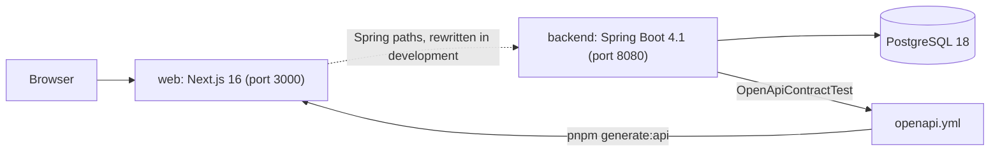

# BeyondPilot architecture

This page states what is implemented today. Intended outcomes are in [docs/vision.md](docs/vision.md); planned work is in [docs/roadmap.md](docs/roadmap.md) and never appears here as a fact. Update this page in the change that makes a statement true or false.

## Runtime overview

- **backend** is one Spring Boot application on Java 25 with virtual threads ([ADR 0001](docs/decisions/0001-single-spring-boot-application-with-modulith-modules.md)). It serves no business endpoint yet. Over HTTP it answers `/actuator/health`, and every failure as an RFC 9457 problem.
- **web** is one Next.js App Router application ([ADR 0002](docs/decisions/0002-nextjs-frontend-over-the-spring-backend.md)). It serves the public home page in English at `/` and in Vietnamese at `/vi`, and a shared coming-soon page for the planned destinations listed in `web/src/lib/site.ts`. It makes no backend call yet.
- **One origin.** Spring owns `/api`, `/login`, `/logout`, `/oauth2` and `/ott`. During development Next.js rewrites those paths to `BEYONDPILOT_API_ORIGIN`; `web/src/proxy.ts` excludes them from locale routing. No reverse proxy is configured, because nothing is deployed.
- **The API contract** is `openapi.yml` at the repository root, generated from the full backend context by `OpenApiContractTest` and turned into TypeScript types in `web/src/lib/api/generated`. It currently declares no path, only the shared `Problem` schema. Both sides fail their gate when their copy is stale.

## Code and capability boundaries

### Backend

Every direct subpackage of `ai.genaifund.beyondpilot` is a closed Spring Modulith module; `ModulithArchitectureTest` verifies the structure and pins the module list. The placement rules are in the [backend guide](docs/guidelines/backend.md#where-things-live).

| Package | Holds today |
| --- | --- |
| `ai.genaifund.beyondpilot` | `BeyondPilotApplication` and the failure types every module shares: `BusinessException`, `FailureReason`, `FailureCategory` |
| `ai.genaifund.beyondpilot.config` | The error path and the OpenAPI configuration; depends on no module |

No business module exists. The error path in `config` is the application's only exception handling ([API errors](docs/conventions.md#api-errors)):

- `RequestIdFilter` gives each request an identifier, returned in `X-Request-Id` and logged as `request_id`.
- `ApiExceptionHandler` turns module failures and request validation into problems with a stable `code`, and keeps Spring MVC's own problems.
- `ProblemErrorController` renders anything that escapes the handler, including uncaught exceptions, as a problem without internal detail.
- `RequestIdProblemAdvice` adds `requestId` to every problem body.

### Web

The folder rules are in [conventions › Frontend › Structure](docs/conventions.md#structure) and the [web guide](web/AGENTS.md).

| Path under `web/src` | Holds today |
| --- | --- |
| `app/[locale]/(public)/` | The home page, composed from sections, and the coming-soon catch-all |
| `components/sections/` | The home page sections: hero with search, programs and events timeline, directory tabs, partner logos, founders, FAQ |
| `components/layout/` | Site header and footer, mobile menu, brand lockup, light and dark theme switch |
| `components/actions/` | The product's action components (`Button`, `IconButton`, `TextButton`, `ActionLink`) over shared action styles |
| `components/ui/` | shadcn registry primitives |
| `lib/api/generated/` | Types generated from `openapi.yml` |
| `i18n/`, `proxy.ts`, `../messages/` | Locale routing (`en` without a prefix, `vi` under `/vi`) and the two message catalogs |
| `styles/tokens.css` | Semantic design tokens, light and dark |

There is no `features/` folder yet: no application screen exists. The home page links its campaign call to action to the interim campaign page that GenAI Fund runs outside this repository.

## Identity and authorization

Not implemented. There is no sign-in, session, user record or role, and Spring Security is not on the classpath. The only request-scoped identity is the request identifier described above.

## Data ownership and consistency

- PostgreSQL 18.6 is the only data store, pinned to the same image for local Docker Compose and for Testcontainers.
- Flyway owns the schema and Hibernate only validates it (`ddl-auto: validate`); `open-in-view` is off. There is no migration and no table yet.
- The rules for the first schema are in the [persistence guideline](docs/guidelines/persistence.md).

## Deployment and operations

- No environment is deployed and no container image is built.
- Local runs use no Spring profile. The `production` profile reads the database from `BEYONDPILOT_DATABASE_*` without defaults and logs Logstash-format JSON; `staging` adds DEBUG logging for the application's own code ([runbook](docs/runbooks/development-runtime.md#profiles-and-environment-variables)).
- Continuous integration runs on every branch push: workflow lint and a secret scan, the backend gate, the web gate with a dependency audit, and Playwright with axe on the production build ([testing guideline](docs/guidelines/testing.md#continuous-integration)). Dependabot proposes Gradle, pnpm and GitHub Actions upgrades weekly.
- Metrics, tracing and dashboards do not exist; logs are the only operational signal.
