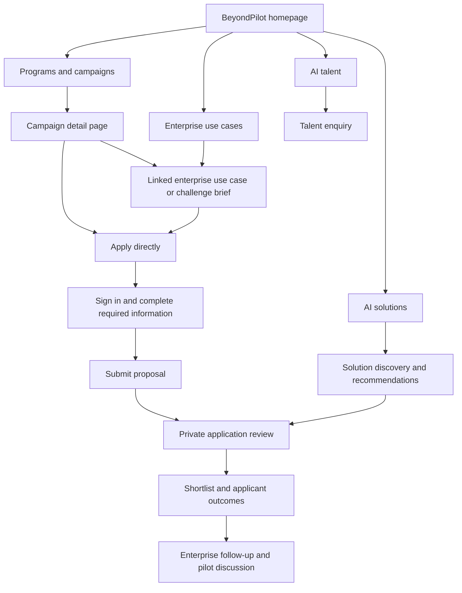
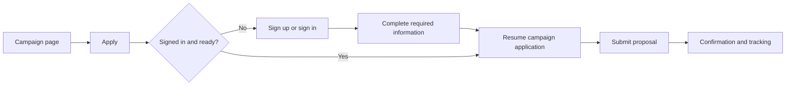
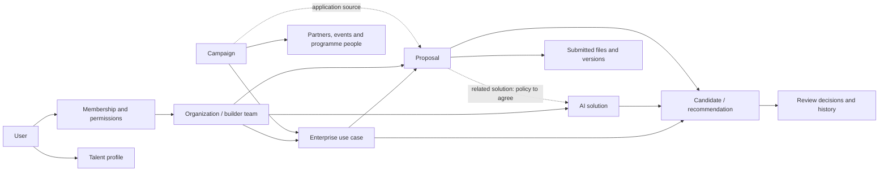

# BeyondPilot
## Product Brief and Development Scope for Vendors

**Prepared by:** GenAI Fund  
**Date:** 30 September 2026  
**Purpose:** Explain the product, user experience and delivery priorities so vendors can propose an implementation approach, phased scope, timeline and quotation.  
**Document status:** Discovery and quotation brief. Open decisions are identified explicitly; final implementation details and acceptance criteria will be agreed before development.

**Sample prototype:** [Explore the BeyondPilot prototype](https://beyondpilot-prototype.dkang-kky.chatgpt.site/#home)

Please use this prototype alongside the brief to visualize the intended layout, navigation, page structure and user interactions. It is a reference for discussion, not confirmation that every displayed feature is functional or included in Phase 1. Use this brief's requirements and phase boundaries when preparing your proposal, and flag any differences you identify.

---

## 1. What we are building

BeyondPilot connects **enterprises with business problems** to **AI solution providers and AI talent** who can help solve them.

GenAI Fund brings enterprises and providers together through campaigns, challenges and other programmes. BeyondPilot should make that process easier to run repeatedly: publish enterprise needs, attract relevant applications, review proposals, shortlist suitable providers and support the next commercial conversation.

The platform also maintains searchable directories of solutions, enterprise use cases and talent. These remain useful beyond individual campaigns.

The immediate product experience is:

> **Launch a campaign featuring enterprise use cases → providers discover the opportunity → register and apply → reviewers assess proposals → shortlist suitable providers.**

This is a revamp of an existing platform. Vendors should assess what can be retained or adapted before proposing a rebuild. Existing functionality, data and prototype materials can be reviewed during discovery; their production readiness must be assessed rather than assumed.

## 2. Why we are building it

Our existing platform has not reduced operational work or improved partner onboarding to the extent we expected. We want the next release to demonstrate those outcomes with real partners before expanding the investment.

The product should help us:

- Launch campaigns without recreating the application process each time.
- Onboard enterprises and providers with less assistance from our team.
- Make enterprise requirements clear and discoverable.
- Collect applications in a consistent place, with reusable provider information.
- Review and shortlist proposals with less manual coordination.
- Build a lasting catalogue of AI solutions and talent.

An attractive directory alone is insufficient. The complete participation and review journey must work.

## 3. Users and their needs

| User | What they need to do |
| --- | --- |
| Public visitor | Understand BeyondPilot, discover campaigns and listings, and decide whether to participate. |
| Enterprise / innovation seeker | Describe a business need, publish a use case, discover relevant solutions, review proposals and select providers for follow-up. |
| AI provider | Present capabilities or solutions, discover opportunities, submit a proposal and follow its outcome. Includes startups and established technology providers. |
| Individual builder / small team | Participate without having to present themselves as an established company. Includes solo builders, freelancers and hackathon or student teams. |
| AI talent | Publish skills and experience, showcase relevant work and receive enquiries. |
| GenAI Fund operator / platform administrator | Manage campaigns, support onboarding, moderate public content, oversee applications, coordinate shortlisting and communicate outcomes. |
| Invited reviewer or judge | Review assigned applications if this role is included in the agreed release. Specific access and scoring requirements need confirmation. |

**Important identity distinction:** a user account, an organization and a public talent profile are different records. A person may participate in more than one capacity. The preferred starting direction is a lightweight organization/team setup that also accommodates a solo builder. Vendors should confirm this model during discovery; a separate personal-versus-organization publishing system is not mandatory for quotation.

## 4. How the product fits together



**Interpretation:** solution discovery can inform an enterprise's review, but an AI-recommended provider is not automatically a campaign applicant. Campaign selection must distinguish received applications from catalogue recommendations.

## 5. Main user journeys

### Journey A — Apply from a campaign

**Example:** A builder finds an AI for Insurance Challenge campaign promoting an enterprise's insurance use cases.

1. They read the challenge, partner information, eligibility, programme dates and submission requirements.
2. They select **Apply**.
3. If needed, they sign up or sign in and complete the minimum required account/provider information.
4. They return directly to the relevant application. They do not have to find the use case again in the general directory.
5. They submit their proposal and any agreed supporting links or materials.
6. They receive confirmation and can find their submission later.
7. Reviewers can assess the proposal as soon as it is received.
8. The applicant receives the agreed outcome.



Preserve the campaign and use-case context throughout authentication, email verification and onboarding. For campaigns with several use cases, agree whether the applicant chooses one, several, or an open-scope challenge route.

### Journey B — Apply from the Use Case directory

Browse/search use cases → open a use case → select Send proposal → complete any required onboarding → submit → track the application.

This shares the same proposal workflow as Journey A. Campaign entry is an additional route into it.

### Journey C — Enterprise publishes a need

Create or join the appropriate organization → create a use case → save and resume a draft → submit for the agreed publication review → publish → receive relevant solution recommendations → invite providers to propose → review incoming proposals → shortlist.

Enterprises should be able to review applications before the submission deadline. Early recommendations and final AI evaluation are separate experiences.

### Journey D — Provider publishes a solution

Create a solution → save and resume a draft → complete required information → request public listing by default or choose unlisted visibility → submit for approval → make the approved solution available according to its visibility setting.

A provider should be able to reuse solution information across opportunities. The exact link between a solution and a proposal is a decision to resolve during discovery.

### Journey E — Talent becomes discoverable

Create a talent profile → submit for review → appear in the talent directory → receive enquiries.

A public talent profile is encouraged but must not be a prerequisite for proposal submission.

## 6. Proposed navigation and screen inventory

The following is an information architecture, not a requirement for separate custom pages for every function. Vendors may propose a simpler interface that preserves the journeys.

```text
BeyondPilot
├── Home
├── Programs & Events
│   └── Campaign detail → Apply
├── Enterprise Use Cases
│   └── Use-case detail → Send proposal
├── AI Solutions
│   └── Solution detail
├── AI Talent
│   └── Talent profile → Contact
├── My Account / Workspace
│   ├── Profile and organization
│   ├── My use cases and drafts
│   │   └── Received proposals and review
│   ├── My solutions and drafts
│   ├── My proposals
│   └── My talent profile
└── Administration
    ├── Campaign content
    ├── Publication review
    ├── Users and organizations
    ├── Applications and authorized review
    └── Operational exports and reporting
```

| Screen / workspace | Main content and actions |
| --- | --- |
| Homepage | Explain the platform, surface active campaigns and provide entry points to the three directories. |
| Campaign directory | Browse programmes and distinguish active, upcoming and completed opportunities where applicable. |
| Campaign detail | Challenge overview, enterprise context, promoted use cases, partners/logos, dates, eligibility, people, submission instructions and Apply CTA. |
| Use Case directory | Search/filter opportunity cards and open the full brief. |
| Use-case detail | Problem, expected outcomes, requirements, enterprise context, dates, team and application CTA. |
| Solution directory/detail | Discover capabilities, product maturity, evidence and relevant provider information. |
| Talent directory/detail | Discover skills, experience, availability and relevant work; send an enquiry. |
| Proposal form | Confirm the opportunity and submitting identity, upload the proposal, provide agreed links and submit. |
| Applicant workspace | Find submissions, confirm receipt and perform permitted updates or withdrawals. |
| Reviewer workspace | View all received proposals, open materials, record assessments and build a shortlist. |
| Admin workspace | Operate the platform with the minimum tools needed for publishing, access, campaign delivery and support. |

## 7. Functional requirements

### 7.1 Accounts and onboarding

- Support straightforward sign-up, sign-in, verification and account recovery.
- Support personal email addresses; corporate email must not be the only route to participation.
- Capture name, email, country and phone with country code. LinkedIn and profile photo are optional in the current baseline.
- Preserve the user's intended action after registration or account completion.
- Keep public talent profiles separate from private account records.
- Enforce access and roles on the server, not only through interface visibility.

**To confirm:** Google plus passwordless email versus Google plus email/password; precise public/member-only access boundaries; any additional verification or approval gates.

### 7.2 Organizations and membership

- Maintain enterprise/provider organization profiles and associate their users.
- Accommodate one-person builder organizations with a lightweight experience.
- Search for existing organizations to reduce duplicates.
- Define who can create content, review proposals and manage members.
- Preserve organization-owned records if a user leaves.
- Keep a descriptive job title separate from an authorization role.

Organization information includes name, type, website or portfolio, location, industries, description, team size, founding year and optional logo. Required fields should be confirmed against the onboarding journey.

**To confirm:** invitations versus join requests, approval rules, role levels and assigned use-case reviewer permissions. Please avoid assuming a comprehensive enterprise permission system is required for the first release.

### 7.3 Campaigns and programmes

- Use a reusable campaign structure so each programme does not need a new application system.
- Manage overview, challenge description, partners, logos, schedule, related events, speakers, mentors and judges.
- Associate campaigns with enterprise use cases.
- Display eligibility, submission instructions and deadlines clearly.
- Provide a direct application CTA with context retained through onboarding.
- Identify which campaign generated an application.

A fixed reusable page template with structured content may be sufficient initially. A general-purpose visual page builder is not required. If an external landing page is proposed temporarily, explain what is integrated, what remains manual and how campaign relationships are preserved.

### 7.4 Enterprise use cases

- Create, save incomplete drafts, reopen, edit and submit.
- Publish through the agreed moderation process.
- Provide searchable listings and clear detail pages.
- Capture the business problem, expected outcomes, existing process, target users, relevant technologies, data readiness, integration/deployment needs, budget and timeline.
- Configure the application window and enforce deadlines consistently.
- Show received applications and permit rolling review.
- Preserve application and decision history when the public listing is removed.

The enterprise should receive relevant solution recommendations promptly after submission, with an invitation-to-propose action. Vendors should price the initial depth of this experience explicitly.

### 7.5 AI solutions

- Create and maintain solution profiles, with incomplete drafts that can be resumed.
- Support a provider having more than one solution, subject to the agreed initial data model.
- Show product name, summary, problems solved, industries, focus areas, maturity, demo/deck and evidence.
- Support optional case studies and relevant additional information without blocking early-stage providers unnecessarily.
- Provide search and useful filters.
- Review public content before listing.

**Visibility requirement:** requesting public listing is selected by default. Owners may choose an approved but unlisted solution that remains shareable under the agreed link-access policy. Approval, directory visibility and matching eligibility must not be treated as one state.

An approved, unlisted solution remains eligible for formal use-case matching. Phase 2 public MCP discovery should use publicly listed solutions only.

**To confirm:** required versus optional deck, sharing permissions, which fields are mandatory at submission and how unlisted matches are shown to enterprises.

### 7.6 Proposal submission and tracking

- Submit a proposal to the correct use case through either campaign or directory entry.
- Reuse relevant account and provider data.
- Capture the file, submission time, provider and campaign/source relationship.
- Confirm successful submission and make it visible in the applicant's workspace.
- Provide the agreed update/withdrawal experience before closing.
- Give authorized reviewers access immediately, including when AI processing is pending or fails.
- Preserve enough version/history information to understand what was reviewed.

The detailed proposal is a PDF; the existing baseline uses a 10 MB limit. Demo/video links and campaign-specific supporting materials need to be included in the final form definition. Do not require a separate lengthy fit questionnaire without agreement.

**To confirm:** solution prerequisites, an optional/required link to an existing solution, team/contact details, proposal drafts, number of submissions and replacement rules. A published talent profile is optional.

### 7.7 Review, shortlisting and outcomes

- List all received proposals and allow review before the deadline.
- Open/download submitted materials according to access permissions.
- Record assessments and decisions with a traceable history.
- Build a shortlist and communicate agreed applicant outcomes.
- Keep proposals outside an AI-ranked shortlist accessible for human review.
- Distinguish direct applicants from providers discovered through the catalogue.

**Recommended workflow to agree:** separate private preliminary assessments from released applicant decisions. Internal work before closing should not unintentionally publish a final outcome.

The exact labels, review-note fields, scoring criteria, reviewer roles and outcome-release controls will be agreed during discovery. Post-selection commercial stages should be retained or simplified according to existing implementation and launch value.

### 7.8 AI discovery and matching

| Capability | Purpose | Scope direction |
| --- | --- | --- |
| Directory search | Find relevant solutions and use cases. | Phase 1 core capability; propose a proportionate implementation. |
| Early recommendations | Help enterprises discover providers after describing a need. | Requested product behavior; quote the initial implementation explicitly. |
| Formal evaluation | Assist comparison of applicable solutions and received proposals against a use case. | Phase 1 implementation depth to agree; assess existing engine reuse. |
| MCP discovery | Let users search BeyondPilot from their own ChatGPT. | Phase 2. |

Formal evaluation may use document extraction and shared evaluation criteria. Vendors should explain how the system handles failed extraction, changing documents, multiple solutions per provider and reasons for recommendations.

The exact model, retrieval stages, scoring method, one-run restriction and rerun policy are not prescribed by this brief. Propose a reliable approach appropriate to the initial scale. Include a way to assess relevance on representative real examples.

Human access to applications must not depend on completion of AI matching. Do not assume that a proposal and a catalogue solution concern the same product solely because they have the same provider.

### 7.9 AI talent

- Create, maintain, review and publish a professional profile.
- Show headline, bio, skills, experience, engagement preferences, availability, location and relevant work.
- Support optional portfolio, CV and rate information, with access rules agreed.
- Search/filter talent and send an enquiry without exposing private email addresses publicly.
- Encourage proposal participants to create profiles without making it a submission condition.

Automatic work summaries, advanced project generation and marketplace transaction features are not necessary assumptions for a basic talent directory.

### 7.10 Administration, notifications and reporting

- Review and approve/reject public listings with reasons.
- Manage platform access and remove inappropriate content.
- Operate campaign content and authorized application review.
- Send essential verification, submission, moderation and outcome communications.
- Keep appropriate records of sensitive changes and proposal access.
- Export operational data and report useful campaign/application counts.
- Reuse existing notification and reporting capabilities where appropriate.

Advanced attribution, a full report-ticket system, extensive notification preferences and comprehensive admin editing tools should be identified separately if they materially increase cost.

## 8. Conceptual data relationships

The diagram communicates business relationships, not a prescribed database schema. Vendors should propose the technical design after resolving the open decisions.



Key rules:

- A solution is reusable product/capability information; a proposal responds to a particular opportunity.
- A campaign can promote multiple use cases. Whether one use case appears in multiple campaigns needs confirmation.
- Account identity, membership, public profile and authorization are separate concepts.
- Public listing approval is distinct from application eligibility.
- Historical submissions and decisions must remain understandable when a profile changes.
- Unlisted content is absent from directory discovery; it is not automatically confidential.

## 9. Example operating scenario

GenAI Fund launches an insurance AI challenge with an enterprise partner.

1. An operator creates the campaign using the existing template, adds partner logos, programme people, dates and linked use cases.
2. A provider reaches the campaign through a partner or social link and selects Apply.
3. The provider registers, completes the agreed minimum information and submits a proposal directly to the intended opportunity.
4. An enterprise/GenAI Fund reviewer sees the new application, opens its materials and records an internal assessment.
5. The team can also discover relevant catalogue solutions, but distinguishes those recommendations from actual applicants.
6. After evaluation, the team finalizes the shortlist and communicates outcomes.
7. Profiles and solution information remain useful for future opportunities after the campaign ends.

**Success means:** the campaign can operate without the team repeatedly redirecting users, collecting missing applications across channels or reconstructing review decisions manually.

## 10. Release priorities and Phase 2

### Phase 1: prove the core journey with real partners

The immediate priority is a usable campaign-to-shortlist journey and easier onboarding. The Solution, Talent and Use Case directories remain important, but the depth of each feature can be simplified to make delivery practical.

Vendors should propose a complete first-release scope that includes the necessary interfaces, backend work, integration, testing and migration. Identify clearly what is retained from the existing platform and what is delivered newly.

A two-week initial delivery window has been requested. The start date, feasible scope and release milestones must be agreed. Please distinguish a working launch release from later enhancements and from final acceptance.

### Phase 2: extend based on Phase 1 evidence

**MCP is allocated to Phase 2.** Users should eventually be able to describe needs and discover publicly listed BeyondPilot solutions from their own ChatGPT without first completing a formal use-case form. Search of enterprise use cases is also part of the earlier discovery direction; precise tool scope and access need agreement.

Other Phase 2 scope, timing and budget are not yet decided. Please do not assume advanced marketplace, automation or commercial features are already committed.

## 11. Existing data, reuse and migration

Existing GAF materials document accounts, organization workspaces, use cases, proposals, matching, decisions, progress stages, notifications and administration. There is also a BeyondPilot prototype and a temporary campaign flow using Lovable/Supabase.

Please assess these assets and identify each relevant module as:

1. Retain with minimal changes.
2. Modify or extend.
3. Replace, with a specific technical or product reason.

Migration planning should cover agreed users and organizations, use cases, provider/solution information, applications, attachments, decisions and relevant campaign attribution. Existing embeddings may be reused only if compatible with the chosen model and data mapping.

The proposal should specify what migration includes, how completeness is checked, how identities and duplicates are handled, and how the transition avoids losing current applications.

## 12. Quality and operational expectations

- Usable on common desktop and mobile browsers; state the supported combinations.
- Consistent layouts and forms using the available BeyondPilot design/brand materials where suitable.
- Reliable saving, uploads, submission confirmation and error recovery.
- Server-side access enforcement and protection of non-public applications and files.
- Clear loading, failure and empty states.
- A testing/staging approach and an agreed production release process.
- Backups, restoration responsibilities and a tested recovery approach.
- Visibility into operating costs, service accounts and recurring dependencies.
- Handover documentation and appropriate client access to source, deployments and data.

No fixed cloud architecture is prescribed. Recommend a proportionate setup and explain cost, maintenance responsibilities and scale assumptions. Do not infer hosting capacity solely from monthly application counts; account for campaign traffic peaks and existing data volume.

## 13. Acceptance examples

These checks illustrate the expected experience. Final criteria should be attached to the agreed release scope.

| Test | Expected result |
| --- | --- |
| New visitor applies from a campaign | Registration returns them to the correct application with campaign/use-case context intact. |
| A solo builder participates | The agreed onboarding model lets them apply without presenting a false established-company identity. |
| Enterprise saves an incomplete use case | The draft can be reopened later with saved progress preserved. |
| Provider saves an incomplete solution | The draft persists and is not publicly listed or reviewed prematurely. |
| Owner chooses approved-unlisted visibility | The solution is absent from public discovery but remains usable through the agreed sharing/matching rules. |
| Proposal arrives before closing | Authorized reviewers can read it immediately, including if extraction is pending or failed. |
| Applicant updates materials | The accepted version and relevant review history are clear. |
| Deadline is reached | New submissions are blocked according to the configured timezone and approved policy. |
| Reviewer makes a preliminary assessment | It follows the agreed private-versus-applicant-visible rule. |
| Outcomes are released | Selected and unsuccessful applicants receive the intended communication. |
| Existing data is migrated | Agreed records and files reconcile with the source; exceptions are documented. |
| AI assists discovery or evaluation | Results can be tested against representative real needs and do not prevent manual review. |

## 14. Launch context and dates to reconcile

The current planning context is the AI for Insurance Challenge. These dates explain urgency; they are not a claim that a new vendor can meet them without discovery.

| Milestone | Existing planning target |
| --- | --- |
| Campaign application flow | As soon as practicable. |
| Solution, Talent and Use Case visibility | Earlier target: first week of October 2026; confirm what is feasible. |
| Rolling proposal review | Target recorded in the delivery brief: before 10 October 2026. |
| Submission close | 15 October 2026, 23:59 ICT / UTC+7. |
| Applicant outcomes | 16 October 2026. |
| Demo day | 22 October 2026, for ten shortlisted teams. |

Please state which milestones you can support, what must be available earlier than the overall release, and whether an interim integration is required. MCP is not part of these Phase 1 dates.

## 15. Decisions to resolve during discovery

| Topic | Decision needed |
| --- | --- |
| Identity and membership | Lightweight organization for every provider versus a separate independent-provider identity; invitations, join requests and permissions. |
| Authentication | Email sign-in method, Google integration and approval gates. |
| Visibility | Public summaries/details, approved-member access, shared links and file downloads. |
| Proposal eligibility | Whether a solution must exist or be approved before applying, including early-stage campaign entrants. |
| Proposal contents | Related solution, team/contact data, PDF, video/demo links, drafts and version limits. |
| Campaign structure | One/multiple use cases, open-scope challenge submissions and campaign/use-case associations. |
| Review | Authorized reviewers, notes/scoring, internal states and outcome-release process. |
| AI | Existing engine reuse, recommendation timing, evaluation depth, retries/reruns and relevance acceptance. |
| Existing functions | What to retain, modify or retire rather than silently lose during migration. |
| Delivery | Exact Phase 1 boundary, dated releases, testing, migration, warranty and maintenance. |

## 16. What we would like vendors to propose

Please respond with:

1. **Your understanding of the product and critical user journeys.** Include a simple screen map or flow sketch where helpful.
2. **A recommended first-release scope.** Separate essential capabilities, simplified implementations and optional later work.
3. **Reuse versus rebuild assessment.** Explain the evidence and assumptions behind replacements.
4. **Implementation approach.** Describe the stack, integrations, hosting and reasons for choosing them without requiring unnecessary platform complexity.
5. **Effort and cost breakdown.** Show frontend, backend, AI, testing, integration and migration effort, with rates or equivalent transparent pricing assumptions.
6. **Schedule and staffing.** Identify dependencies, the critical path and staged releases. Separate any accelerated-delivery premium.
7. **Recurring costs and responsibilities.** Include hosting, storage, AI, email, monitoring and maintenance assumptions.
8. **Acceptance and handover.** Explain testing, release, migration verification, documentation, support and change-request handling.
9. **Assumptions, exclusions and open questions.** Avoid treating unresolved policies as agreed requirements.
10. **Optional Phase 2 items.** Quote only clearly described options; do not assume an automatic follow-on commitment.

Commercial budget constraints and access to existing technical assets will be discussed separately. The aim is a proportionate first release that proves operational value and leaves a sensible path for extension.

## 17. Boundaries

This brief does not assume an Upwork-style transactional marketplace, payments, escrow, freelancer contract management, public ratings, autonomous outreach, open-web scraping or autonomous publishing. Those require separate product decisions.

MCP belongs to Phase 2. Other advanced functionality is optional until agreed. This document describes intended product behavior and quotation needs; it is not approval of a particular architecture, full rebuild or fixed-price contract.
