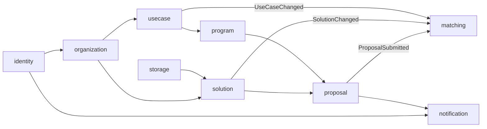

# Phase 1 domain model

Status: draft for review, 2 October 2026. The module list was settled on 3 October 2026: `catalog` is named `solution`, review and outcome release belong to `proposal`, and `notification` sends email. The tables are still for review. Implementation starts after approval, one vertical slice at a time ([plan](plan.md)).

## Purpose and scope

BeyondPilot gets its own data model, built for matching and for use by AI. The schema of the existing GenAI Fund platform (`app.genaifund.ai`, "v1") is a reference and a migration source only; it is never the shape to copy. This document follows [boundary discovery](../../../conventions.md#boundary-discovery): domain stories, glossary, commands and events, data owners, context map, then tables.

In scope: accounts and organizations, the solution catalog, AI talent, enterprise use cases, programs and campaigns, proposals, candidate lists with review and matching, documents, and the migration from v1. Out of scope: MCP access (Phase 2), payments, ratings and anything in [brief §17](../../../brief/BeyondPilot-Vendor-Product-Brief-and-Scope.md#17-boundaries).

### Inputs

- The [product brief](../../../brief/BeyondPilot-Vendor-Product-Brief-and-Scope.md), §3 to §8 and §15.
- The kickoff meeting on 2 October 2026 with GenAI Fund (Kai Yong Kang, Laura Nguyen); the [transcript](../../../research/sources/2026-10-02-kickoff-transcript.md) is kept with the research.
- An inventory of v1: public pages, the use case form, startup registration and profile, the matches view, admin functions, and the values of 14 real startup profiles. Recorded in the research note on the [existing products](../../../research/2026-10-02-existing-products.md).
- Kai's prototype (`beyondpilot-prototype.dkang-kky.chatgpt.site`) and the interim AI for Insurance Challenge application on Lovable.
- Kai's research skill [`use-case-solution-research.md`](../../../research/sources/use-case-solution-research.md): how GenAI Fund scouts vendors for a use case today.
- The programs and events of GenAI Fund from its blog and Luma calendars: the research note on [programs and events](../../../research/2026-10-02-programs-and-events.md).

### What v1 teaches

| Observation in v1                                                                                                                                                                             | Consequence here                                                                                                                           |
| --------------------------------------------------------------------------------------------------------------------------------------------------------------------------------------------- | ------------------------------------------------------------------------------------------------------------------------------------------ |
| Organizations exist before their people: GenAI Fund imports startups and enterprises, and a person registers by searching for the company and joining with a code or an accepted email domain | An organization can be _unclaimed_; claiming is an explicit, verified step                                                                 |
| About half of the profile fields of matched startups are empty; multi-value fields are strings joined with `                                                                                  |                                                                                                                                            |     | ` or commas; "Other: …" is written into the field; test records were approved | Structured values only, a separate "other" text, AI-filled values marked as such, and a cleaning step in migration |
| Three different industry lists (22, 13 and 25 entries); solution types mixed with industries                                                                                                  | One canonical taxonomy with a mapping from every legacy list                                                                               |
| Matching was keyword based and about 30% right (Laura); results were swiped Love, Save or Pass; operators could not add a provider they knew or remove a wrong match                          | Candidates carry a source, a relevance bucket with evidence, and a reversible decision with a reason; operators add and dismiss candidates |
| Direct proposals and AI matches were already shown together per use case                                                                                                                      | One candidate list per use case for every source                                                                                           |

## Domain stories

1. **Apply to a program.** A provider opens a program page and selects Apply. They sign in with Google or an email link and return to the same application. They join their organization: they claim an existing record, or they create one. The application is pre-filled from the organization's solution profile and saved as a draft. They answer the program's questions, attach a deck and a demo link, and submit before the deadline. They get a confirmation and can find the proposal later. An operator sees it at once among the program's applications; when it answers a use case it is also a candidate for that use case, with the source _applied_. _Failures:_ the deadline passes while the draft is open, so submission is refused. The email link expires, so they request a new one. Text extraction of the deck fails, but reviewers can still open the file.
2. **Source providers for a use case.** An operator confirms a use case's requirements. They run a database match and a web research pass. The candidates are placed in relevance buckets with cited evidence. The operator dismisses a wrong candidate with a reason, adds a provider they know by hand, and asks shortlisted providers for more information. The 3 to 5 strongest form the shortlist. _Failures:_ web research finds a company that already exists under another name, so the system proposes a merge instead of creating a duplicate.
3. **Maintain a solution.** A provider claims their organization, edits a solution and submits it for approval. GenAI Fund approves it; the provider keeps it listed or chooses unlisted. AI-extracted values stay marked until the provider confirms them.
4. **Publish a use case.** An enterprise, or an operator on its behalf, drafts a use case. Optionally it hides the enterprise's name. It submits the use case for approval; once approved and published, it can be featured in programs.
5. **List talent.** A person creates a talent profile, which is reviewed and then appears in the directory. Visitors send enquiries through the platform, never to a public email address.
6. **Review and release outcomes.** An operator reads each application of a program, shortlists it or marks it not selected, and may leave a private assessment. When no application is still under review, the operator releases outcomes for the program. Applicants see their result and receive an email; internal assessments stay private.

## Glossary

| Term                 | Meaning                                                                                                                                                                                              | Not to be confused with                                                              |
| -------------------- | ---------------------------------------------------------------------------------------------------------------------------------------------------------------------------------------------------- | ------------------------------------------------------------------------------------ |
| **Account**          | A person who signs in. Private                                                                                                                                                                       | Talent profile, member                                                               |
| **Organization**     | A company or team. It has the _provider_ role, the _enterprise_ role, or both. A solo builder is an organization with one member                                                                     | v1 "startup" (a provider organization) and "enterprise" (an enterprise organization) |
| **Member**           | An account's membership in an organization, with an authorization role (`owner`, `member`) and a free-text job title                                                                                 | Job title, platform role                                                             |
| **Operator**         | A GenAI Fund staff account with the platform role `operator`                                                                                                                                         | Organization owner                                                                   |
| **Reviewer**         | An account invited to review one program                                                                                                                                                             | Operator                                                                             |
| **Solution**         | Reusable product or capability information owned by a provider organization. One organization may have several                                                                                       | Proposal                                                                             |
| **Evidence**         | A sourced claim that supports a solution: a case study, customer reference, deployment, demo, pilot or product documentation                                                                         | Marketing copy                                                                       |
| **Offer**            | A benefit a provider gives BeyondPilot members, such as credits or a pilot package                                                                                                                   | Discount on fees                                                                     |
| **Talent profile**   | A public professional profile of a person, optionally linked to an account                                                                                                                           | Account                                                                              |
| **Use case**         | An enterprise's business problem, published as an opportunity                                                                                                                                        | Program                                                                              |
| **Requirement**      | One functional requirement of a use case, marked required or optional                                                                                                                                | Use case tag                                                                         |
| **Program**          | Anything GenAI Fund runs: a challenge, open innovation call, accelerator, hackathon, grant, venture building or event series. A program that accepts applications is what the brief calls a campaign | Program event                                                                        |
| **Program event**    | A dated session within a program, usually registered on Luma                                                                                                                                         | Program                                                                              |
| **Proposal**         | An organization's response to a use case, a program, or both. It has versions                                                                                                                        | Solution, candidate                                                                  |
| **Candidate**        | An organization, and optionally one of its solutions, considered for a use case. It always has a _source_: applied, database match, web research or added by an operator                             | v1 "match"                                                                           |
| **Relevance bucket** | Kai's classification of a candidate: _direct relevance_, _industry relevance_ or _technology capability_                                                                                             | Score                                                                                |
| **Research run**     | One AI research pass for a use case, with its scope and coverage gaps                                                                                                                                | Candidate                                                                            |
| **Assessment**       | A private note or score by a reviewer                                                                                                                                                                | Outcome                                                                              |
| **Outcome**          | The result an applicant is allowed to see, released by an operator                                                                                                                                   | Assessment                                                                           |
| **Document**         | An uploaded or fetched file with its versions and extracted text                                                                                                                                     | Evidence                                                                             |

## Commands, events, aggregates and read models

| Module         | Aggregates                                                              | Main commands                                                                                                                       | Events published                                                    | Read models                                        |
| -------------- | ----------------------------------------------------------------------- | ----------------------------------------------------------------------------------------------------------------------------------- | ------------------------------------------------------------------- | -------------------------------------------------- |
| `identity`     | Account                                                                 | Sign in with Google, request and redeem an email link, sign out, grant the operator role                                            | `AccountCreated`                                                    | Current account                                    |
| `organization` | Organization (with members, domains, aliases, invitations)              | Create, claim, invite, join by verified domain, edit profile, merge duplicates                                                      | `OrganizationClaimed`, `OrganizationsMerged`, `OrganizationChanged` | Organization search for joining and de-duplication |
| `solution`      | Solution (with evidence, offers, materials)                             | Create draft, edit, submit for approval, approve or reject, list or unlist, confirm AI-filled values                                | `SolutionPublished`, `SolutionChanged`                              | Solution directory with facets, solution page      |
| `talent`       | Talent profile, enquiry                                                 | Create, submit, approve, send an enquiry                                                                                            | `TalentProfilePublished`                                            | Talent directory                                   |
| `usecase`      | Use case (with requirements)                                            | Draft, submit, approve, publish, close                                                                                              | `UseCasePublished`, `UseCaseChanged`                                | Use case directory                                 |
| `program`      | Program (with events, people, featured use cases, application settings) | Create, publish, open and close applications, feature a use case                                                                    | `ProgramApplicationsClosed`                                         | Program directory, program page                    |
| `proposal` | Proposal (with versions, review and outcome) | Start, save draft, submit, update before the deadline, withdraw; shortlist, mark not selected, assess, release outcomes of a program | `ProposalSubmitted`, `ProposalWithdrawn`, `OutcomesReleased` | My proposals, applications of a program for operators |
| `matching` | Candidate list (per use case), research run | Run a database match, run web research, add a candidate, dismiss, restore, shortlist, request information | `CandidateShortlisted` | Candidate board, search index, AI profile cards |
| `storage`     | Document (with versions)                                                | Upload, register an external link, extract text                                                                                     | `DocumentExtracted`                                                 | —                                                  |
| `notification` | — | Send an email from a template | — | — |

Synchronous invariants stay inside one aggregate, for example "no submission after the deadline" or "one owner at least". Cross-module reactions are asynchronous through Spring Modulith events:

- A submitted proposal that answers a use case becomes a candidate for it.
- A changed solution is re-indexed for search.
- Released outcomes reach each applicant by email.

## Modules, owners and context map

Each module owns its tables, lifecycle and invariants. Other modules hold only its identifiers and call its published API ([persistence](../../../guidelines/persistence.md#schema-ownership)). Modules are created with their first code, in the order of the [plan](plan.md); none is predeclared.

| Module         | Owns                                                                                                                   | Depends on                                                                   |
| -------------- | ---------------------------------------------------------------------------------------------------------------------- | ---------------------------------------------------------------------------- |
| `shared`       | Taxonomy values (codes, labels, descriptions), identifier types. No beans                                              | —                                                                            |
| `identity` | Accounts, external identities, one-time tokens, sessions, platform roles | `notification` |
| `notification` | Email sending and its templates. It knows no other module; a module that needs an email calls it | — |
| `storage`     | Documents, versions, extracted text, the file store                                                                    | —                                                                            |
| `organization` | Organizations, members, domains, aliases, invitations, claims                                                          | `identity`                                                                   |
| `solution`      | Solutions, evidence, offers, solution materials                                                                        | `organization`, `storage`                                                   |
| `talent`       | Talent profiles, enquiries                                                                                             | `identity`, `storage`                                                       |
| `usecase`      | Use cases, requirements                                                                                                | `organization`, `storage`                                                   |
| `program`      | Programs, program events, people, partners, featured use cases, application settings and questions                     | `usecase`, `organization`                                                    |
| `proposal` | Proposals, versions, answers, review status, assessments, outcomes shown to applicants | `organization`, `program`, `usecase`, `solution`, `storage`, `notification` |
| `matching` | Candidates, sources, evidence links, decisions, research runs, search index, embeddings, AI profile cards | `organization`, `solution`, `usecase`, `program`, `proposal` (events and API) |

`matching` reads the other modules only through their APIs and events. The search index and embeddings are its own projections, so AI-derived data never overwrites a source of truth.

Review belongs to `proposal`, not to `matching`: operators review the applications of a program whether or not the program has use cases (the AI for Insurance Challenge has none), and that work needs no AI. `matching` is the sourcing of candidates for one use case. `notification` depends on nothing, so any module may call it without creating a cycle.

## Data model

Conventions for every table:

- UUID primary keys and `created_at` and `updated_at` timestamps.
- `@Version` where commands can race.
- Taxonomy values are stable lowercase codes from `shared`, stored as `text` or `text[]` with GIN indexes for facet filtering.
- Countries are ISO 3166-1 alpha-2 codes.
- Money is an integer amount plus a currency code.
- "Unknown" is `null`, never zero (Kai's rule: unknown means unverified).

### Provenance

Every record that may come from outside the owner carries:

- `source`: `self_reported`, `operator`, `legacy_import`, `ai_extracted` or `web_research`;
- `source_url` and `retrieved_at` where the source is external;
- for records with mixed sources, `field_sources jsonb`, which maps a field to `{source, url, at}`.

AI-filled values stay `ai_extracted` until the owner confirms them.

### identity

| Table                                     | Key columns                                                                                                  |
| ----------------------------------------- | ------------------------------------------------------------------------------------------------------------ |
| `identity_account`                        | `email` (unique on `lower(email)`), `display_name`, `status` (`active`, `disabled`), `platform_role` (`user`, `operator`), `last_login_at`. Implemented: see the [identity increment](../bey-30-identity/design.md) |
| `identity_external_identity`              | `account_id`, `provider` (`google`), `subject` unique per provider                                           |
| Spring Security and Spring Session tables | One-time tokens for email links, JDBC sessions                                                               |

### organization

| Table                        | Key columns                                                                                                                                                                                                                                                                                                                                                                                                                                                  |
| ---------------------------- | ------------------------------------------------------------------------------------------------------------------------------------------------------------------------------------------------------------------------------------------------------------------------------------------------------------------------------------------------------------------------------------------------------------------------------------------------------------ |
| `organization`               | `name`, `slug unique`, `roles text[]` (`provider`, `enterprise`), `provider_type` (Kai's list: `startup`, `isv`, `solution_provider`, `it_outsourcing`, `system_integrator`, `established_technology_company`, `other`), `website`, `primary_domain`, `hq_country`, `presence_countries text[]`, `founded_year`, `team_size_band`, `industries text[]`, `description`, `logo_document_id`, `claim_status` (`unclaimed`, `claimed`), `visibility`, provenance |
| `organization_alias`         | `organization_id`, `alias` (normalized, unique) for de-duplication                                                                                                                                                                                                                                                                                                                                                                                           |
| `organization_domain`        | `organization_id`, `domain unique`, `verified_at`, `auto_join`                                                                                                                                                                                                                                                                                                                                                                                               |
| `organization_member`        | `organization_id`, `account_id`, `role` (`owner`, `member`), `job_title`. Unique per pair; at least one owner per claimed organization                                                                                                                                                                                                                                                                                                                       |
| `organization_invitation`    | `organization_id`, `email`, `role`, `token_hash`, `expires_at`, `accepted_at`                                                                                                                                                                                                                                                                                                                                                                                |
| `organization_funding_round` | `organization_id`, `stage` (`bootstrapped`, `angel`, `pre_seed`, `seed`, `bridge`, `series_a`…), `amount`, `currency`, `announced_on`, provenance                                                                                                                                                                                                                                                                                                            |

### solution

| Table              | Key columns                                                                                                                                                                                                                                                                                                                                                                                                                                                                                                                                                                                                                |
| ------------------ | -------------------------------------------------------------------------------------------------------------------------------------------------------------------------------------------------------------------------------------------------------------------------------------------------------------------------------------------------------------------------------------------------------------------------------------------------------------------------------------------------------------------------------------------------------------------------------------------------------------------------- |
| `solution` | `organization_id`, `name`, `slug`, `summary`, `problems_solved`, `value_proposition`, `focus_areas text[]`, `industries text[]`, `maturity` (`idea`, `prototype`, `pilot`, `production`, `scaled`, `retired`), `segments text[]` (`b2b`, `b2c`, `b2b2c`, `b2g`, `c2b`), `monetization text[]`, `best_customer_profile`, `built_with text[]`, `deployment text[]` (`cloud_saas`, `private_cloud`, `on_premise`, `hybrid`), `competitors`, `approval_status` (`draft`, `submitted`, `approved`, `rejected`), `listing` (`listed`, `unlisted`), `matching_eligible boolean`, provenance, `search_vector tsvector` (generated) |
| `solution_evidence` | `solution_id`, `kind` (`case_study`, `customer_reference`, `deployment`, `pilot`, `demo`, `technical_evaluation`, `product_documentation`), `title`, `customer_name`, `customer_industry`, `problem`, `outcome`, `is_named`, `independence` (`vendor_reported`, `independent`), `url`, `occurred_on`, provenance                                                                                                                                                                                                                                                                                                           |
| `solution_offer`    | `solution_id`, `title`, `description`, `value`, `eligibility`, `terms`, `expires_on`, `claim_method` (`link`, `request`), `claim_url`, `status`                                                                                                                                                                                                                                                                                                                                                                                                                                                                            |
| `solution_material` | `solution_id`, `kind` (`customer_deck`, `pitch_deck`, `demo_link`, `video`), `document_id` or `url`                                                                                                                                                                                                                                                                                                                                                                                                                                                                                                                        |

The three visibility states of [brief §7.5](../../../brief/BeyondPilot-Vendor-Product-Brief-and-Scope.md#75-ai-solutions) are separate columns: approval, listing and matching eligibility.

### talent

| Table            | Key columns                                                                                                                                                                                                                                                         |
| ---------------- | ------------------------------------------------------------------------------------------------------------------------------------------------------------------------------------------------------------------------------------------------------------------- |
| `talent_profile` | `account_id` (nullable), `name`, `headline`, `bio`, `roles text[]` (`ai_engineer`, `forward_deployed_engineer`, `automation_specialist`, …), `skills text[]`, `country`, `availability`, `engagement text[]`, `rate_band`, `approval_status`, `listing`, provenance |
| `talent_project` | `profile_id`, `title`, `summary`, `url`, `occurred_on`                                                                                                                                                                                                              |
| `talent_enquiry` | `profile_id`, `sender_account_id`, `message`, `status`. The talent's email is never exposed                                                                                                                                                                         |

### usecase

| Table                 | Key columns                                                                                                                                                                                                                                                                                                                                                                                                                                                                                                                                                           |
| --------------------- | --------------------------------------------------------------------------------------------------------------------------------------------------------------------------------------------------------------------------------------------------------------------------------------------------------------------------------------------------------------------------------------------------------------------------------------------------------------------------------------------------------------------------------------------------------------------- |
| `usecase_use_case`    | `organization_id`, `posted_by_account_id`, `code` (stable, for example `UC01`), `title`, `problem_statement`, `current_process`, `target_users`, `expected_outcomes`, `current_solutions`, `data_readiness`, `integration_requirements`, `industries text[]`, `capabilities text[]`, `budget_min`, `budget_max`, `currency`, `budget_visibility`, `preferred_timeline`, `anonymous boolean`, `status` (`draft`, `submitted`, `approved`, `published`, `closed`, `archived`), `applications_open_at`, `applications_close_at`, `timezone`, provenance, `search_vector` |
| `usecase_requirement` | `use_case_id`, `position`, `statement`, `necessity` (`required`, `optional`), `source_quote` (the source fact, kept apart from interpretation)                                                                                                                                                                                                                                                                                                                                                                                                                        |
| `usecase_attachment`  | `use_case_id`, `document_id`                                                                                                                                                                                                                                                                                                                                                                                                                                                                                                                                          |

### program

| Table                          | Key columns                                                                                                                                                                                                                                                                                                                                   |
| ------------------------------ | --------------------------------------------------------------------------------------------------------------------------------------------------------------------------------------------------------------------------------------------------------------------------------------------------------------------------------------------- |
| `program`                      | `slug`, `name`, `type` (`enterprise_challenge`, `open_innovation_call`, `accelerator`, `hackathon`, `buildathon`, `grant`, `venture_building`, `pitch_competition`, `event_series`, `event`), `summary`, `body`, `countries text[]`, `starts_on`, `ends_on`, `status` (`draft`, `published`, `archived`), `cover_document_id`, `external_url` |
| `program_application_settings` | `program_id`, `opens_at`, `closes_at`, `timezone`, `scope` (`use_cases`, `open`, `both`), `max_use_cases_per_proposal`, `allow_updates_until_close`                                                                                                                                                                                           |
| `program_question`             | `program_id`, `position`, `prompt`, `kind` (`text`, `long_text`, `choice`, `url`, `file`), `required`, `options jsonb`                                                                                                                                                                                                                        |
| `program_use_case`             | `program_id`, `use_case_id`, `position`. Many to many (BEY-6)                                                                                                                                                                                                                                                                                 |
| `program_partner`              | `program_id`, `organization_id`, `role` (`enterprise`, `technology_partner`, `institution`)                                                                                                                                                                                                                                                   |
| `program_person`               | `program_id`, `name`, `title`, `role` (`judge`, `mentor`, `speaker`), `photo_document_id`, `linkedin_url`                                                                                                                                                                                                                                     |
| `program_event`                | `program_id`, `title`, `starts_at`, `ends_at`, `timezone`, `city`, `country`, `online`, `registration_url` (Luma), `guest_count`                                                                                                                                                                                                              |
| `program_milestone`            | `program_id`, `title`, `occurs_at`, `description` (timeline items such as briefing, deadline, demo day)                                                                                                                                                                                                                                       |

### proposal

| Table               | Key columns                                                                                                                                                                                                                                                                                                   |
| ------------------- | ------------------------------------------------------------------------------------------------------------------------------------------------------------------------------------------------------------------------------------------------------------------------------------------------------------- |
| `proposal`          | `organization_id`, `submitted_by_account_id`, `program_id` (nullable), `use_case_id` (nullable, at least one of the two), `solution_id` (nullable), `status` (`draft`, `submitted`, `withdrawn`), `submitted_at`, `current_version`, `review_status` (`under_review`, `shortlisted`, `not_selected`; internal), `outcome` (`pending`, `selected`, `not_selected`), `outcome_released_at` |
| `proposal_version`  | `proposal_id`, `number`, `summary`, `approach`, `pilot_needs`, `contact jsonb`, `created_at`. Reviewers always see which version they reviewed                                                                                                                                                                |
| `proposal_answer`   | `version_id`, `question_id`, `value jsonb`                                                                                                                                                                                                                                                                    |
| `proposal_material` | `version_id`, `kind`, `document_id` or `url`                                                                                                                                                                                                                                                                  |
| `proposal_review_decision` | `proposal_id`, `actor_account_id`, `from_status`, `to_status`, `reason`, `at`. Append-only history |
| `proposal_assessment` | `proposal_id`, `version_number`, `reviewer_account_id`, `criteria jsonb`, `note`, `score`. Never shown to applicants |

The deadline is enforced in the aggregate against the program's or use case's window and timezone ([brief §13](../../../brief/BeyondPilot-Vendor-Product-Brief-and-Scope.md#13-acceptance-examples)).

### matching

| Table                         | Key columns                                                                                                                                                                                                                                                                                                                                                                                                                                                                                                                                   |
| ----------------------------- | --------------------------------------------------------------------------------------------------------------------------------------------------------------------------------------------------------------------------------------------------------------------------------------------------------------------------------------------------------------------------------------------------------------------------------------------------------------------------------------------------------------------------------------------- |
| `matching_candidate`          | `use_case_id`, `organization_id`, `solution_id` (nullable), `proposal_id` (nullable), `sources text[]` (`applied`, `database_match`, `web_research`, `operator_added`), `bucket` (`direct_relevance`, `industry_relevance`, `technology_capability`, or null until classified), `rationale`, `validation_gaps`, `priority_hint` (`strongest_evidence`, `promising_emerging`), `status` (`suggested`, `under_review`, `shortlisted`, `dismissed`), `dismiss_reason`. Unique per use case and organization, so every source merges into one row |
| `matching_candidate_evidence` | `candidate_id`, `evidence_id` (solution) or `url`, `claim`, `evidence_kind`, `independence`, `retrieved_at`                                                                                                                                                                                                                                                                                                                                                                                                                                    |
| `matching_decision`           | `candidate_id`, `actor_account_id`, `from_status`, `to_status`, `reason`, `at`. Append-only history                                                                                                                                                                                                                                                                                                                                                                                                                                           |
| `matching_research_run`       | `use_case_id`, `kind` (`database_match`, `web_research`), `geographies text[]`, `model`, `started_at`, `finished_at`, `status`, `coverage_gaps`, `candidate_count`                                                                                                                                                                                                                                                                                                                                                                            |
| `matching_search_document`    | `owner_type` (`solution`, `use_case`, `organization`, `talent`), `owner_id`, `card` (canonical text for AI: one block per entity), `facets jsonb`, `search_vector`, `content_hash`, `indexed_at`                                                                                                                                                                                                                                                                                                                                              |
| `matching_embedding`          | `search_document_id`, `field` (`summary`, `problems`, `outcomes`, `evidence`), `model`, `dimensions`, `vector`, `content_hash`                                                                                                                                                                                                                                                                                                                                                                                                                |

## Taxonomy

Canonical vocabularies live in `shared` as code, label and one-line description. The descriptions are what an LLM reads when it classifies. Changing a vocabulary is a reviewed code change with a migration for stored values.

| Vocabulary                                       | Canonical source                                                            | Legacy lists mapped onto it                                         |
| ------------------------------------------------ | --------------------------------------------------------------------------- | ------------------------------------------------------------------- |
| Industry                                         | The 22 industries of v1 use cases and of the startup "target market"        | v1 admin startup filter (13), v1 enterprise registration (25)       |
| AI capability (focus area)                       | The 13 "solution focus areas" of v1 startup registration, with descriptions | v1 use case "relevant AI technologies" (10), prototype focus areas  |
| Maturity                                         | `idea` → `retired`                                                          | v1 product stage, prototype "Production / Live", "Pilot deployment" |
| Provider type                                    | Kai's research skill                                                        | v1 company type (`SUP`)                                             |
| Segment, monetization, funding stage, deployment | Values observed in v1 profiles, cleaned                                     | v1 strings with `                                                   |     |     | ` and "Other: …" |
| Program type                                     | GenAI Fund's programs on its blog and Luma                                  | —                                                                   |
| Relevance bucket, evidence kind, independence    | Kai's research skill                                                        | —                                                                   |

## Matching and AI

- **Explainable before numeric.** A candidate's primary output is a relevance bucket with a rationale, cited evidence and validation gaps. Numeric similarity only orders candidates inside a bucket.
- **Hybrid retrieval in PostgreSQL.** Hard filters on taxonomy facets, full-text search on `search_vector`, and vector similarity with pgvector on per-field embeddings, merged by rank. This replaces v1's keyword match. The choice of model, dimensions and the pgvector image is researched in BEY-21.
- **AI profile cards.** `matching_search_document.card` is one canonical text block per entity: facts, taxonomy labels, evidence and provenance. Prompts read it, embeddings are built from it, and MCP will serve it in Phase 2.
- **Research loop.** A web research run creates or updates _unclaimed_ organizations and solutions with the `web_research` source, after alias and domain de-duplication. It then adds them as candidates. Later database matches find them without repeating the research (Kai's positive loop).
- **Humans decide.** Operators add, dismiss with a reason, restore and shortlist. Every change is a `matching_decision`. AI never removes a candidate, and access to proposals never waits for AI ([brief §7.8](../../../brief/BeyondPilot-Vendor-Product-Brief-and-Scope.md#78-ai-discovery-and-matching)).
- **Private versus released.** Assessments and review statuses are internal to `proposal`; only `proposal.outcome` after release is visible to applicants ([brief §7.7](../../../brief/BeyondPilot-Vendor-Product-Brief-and-Scope.md#77-review-shortlisting-and-outcomes)).

## Migration from v1

The real export arrives on 5 October 2026; this mapping is checked against it before any import code is written.

| v1                                                                                                                                      | BeyondPilot                                                                                                                                                                                    |
| --------------------------------------------------------------------------------------------------------------------------------------- | ---------------------------------------------------------------------------------------------------------------------------------------------------------------------------------------------- |
| Enterprise                                                                                                                              | `organization` with the `enterprise` role; accepted email domains become `organization_domain`                                                                                                 |
| Startup                                                                                                                                 | `organization` with the `provider` role, plus one `solution` built from the product fields                                                                                             |
| Startup company facts (country, year, funding)                                                                                          | `organization`, `organization_funding_round`                                                                                                                                                   |
| Startup product fields (solution types, stage, segment, monetization, tech stack, infrastructure, UVP, problems, milestones, customers) | `solution`; customers and milestones become `solution_evidence` where they are concrete                                                                                                 |
| Decks and demos                                                                                                                         | `storage` and `solution_material`                                                                                                                                                              |
| Use case                                                                                                                                | `usecase_use_case`; v1 tags become taxonomy codes where they map, otherwise they are dropped and reported                                                                                      |
| Program tags on use cases (Nestlé, Shinhan, Tasco, GOI)                                                                                 | `program` and `program_use_case`                                                                                                                                                               |
| Proposal and attachments                                                                                                                | `proposal`, `proposal_version`, `proposal_material`                                                                                                                                            |
| AI match with Love, Save or Pass                                                                                                        | `matching_candidate` with the `database_match` source and status `suggested`. v1 decisions are not statuses here; each is kept as a `matching_decision` note marked legacy, for reference only |
| Users                                                                                                                                   | `identity_account` and `organization_member`; passwords are not migrated, because sign-in is Google or an email link                                                                           |
| Current Insurance Challenge applications (Lovable)                                                                                      | `proposal` under the program, after the decision in the plan                                                                                                                                   |

Cleaning rules:

- Split joined multi-values.
- Map legacy labels to codes, and keep unmapped values in an "other" text.
- Drop test records and list them.
- Convert empty strings and "Not specified" to `null`.
- Mark every value with the `legacy_import` source.
- Reconcile record and file counts against the export, and document every exception ([brief §11](../../../brief/BeyondPilot-Vendor-Product-Brief-and-Scope.md#11-existing-data-reuse-and-migration)).

## Decisions of 3 October 2026

- **Build order:** `identity`, `notification`, `storage`, `program`, `organization`, `solution`, `usecase`, `talent`, `proposal` (apply, then review), `matching`. Each has its own Linear issue (BEY-30 to BEY-39, with BEY-29 for `program`). The import from v1 follows the code; it does not gate it.
- **Files:** every file goes through `storage` (named `document` in the first draft) behind a storage adapter: the file system first, MinIO or S3 later, chosen by configuration. No module stores a fixed image path. BEY-32 settled the names: the table is `storage_file`, a column that names a file is `<what>_file_id`, and `storage` depends on `identity`, because the upload addresses are its own ([storage increment](../bey-32-storage/design.md)). Versions and extracted text arrive with proposals and matching.
- **Programs are entered, not seeded:** an operator creates and edits programs on screen, so `program` follows `identity` and `storage`.
- **Program page content:** `program_section` holds the page's own presentation as ordered blocks (`position`, `kind`, `title`, `lead`, `content jsonb`) with four or five kinds; timeline, people, partners and events stay tables. It replaces `program.body`. A program page is one of three kinds: composed from blocks (the default), a hand-coded page in the web application for a program that needs it, or a redirect to an external landing page when `external_url` is set.
- **Program partners** carry their own name and logo for now; the link to an organization is added when `organization` exists.
- **Joining an organization by email domain:** an email on an organization's verified domain joins at once as a plain member, as on v1 and on comparable products; an owner can switch this off, after which joining is a request. Public mail domains never count. The first person with an email on the website domain of an unclaimed organization becomes its owner. This closes the open question on joining by email domain.

## Open questions

v1 behavior and Kai's prototype are references from users of the product; the model above is BeyondPilot's own definition. Decided on 2 October 2026:

- Love, Save and Pass are not carried over as statuses (see the migration table).
- Whether the Insurance Challenge applications move before or after 15 October is decided once the UI exists.
- Automatic outreach is Phase 2. Whether web research is in the 16 October scope is tracked in BEY-23.
- Messaging, use case voting and anonymous use cases are tracked in BEY-24; only the `anonymous` flag is modeled.

Still open, to ask GenAI Fund (BEY-25). The model supports either answer, so it does not block implementation:

1. **Offers:** GenAI Fund probably creates them; the alternative is that providers post offers and GenAI Fund approves them. Claiming is either a code or link handed out at once, or a request the provider accepts (`solution_offer.claim_method`).

## Verification

- `ModulithArchitectureTest` lists each module as it is created, with the dependencies in the table above and no cycles.
- Every module ships repository tests against PostgreSQL through Testcontainers.
- Constraints are tested at the database: one candidate per use case and organization, at least one owner, no submission after the window.
- The migration produces a reconciliation report: counts per entity, files, dropped records and unmapped values.
